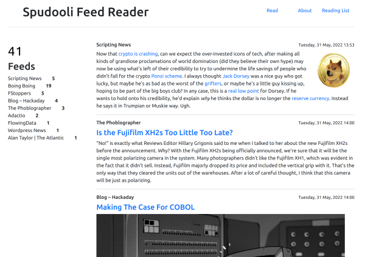

# spudooli-reader
An RSS feed reader made by me, just for me. But it can be for you too, if you want.

**Features**
- A resonably capable RSS feed parser - It even handles the inventor of RSS, Dave Winer's feed, although doesn't handles dates or timezones well as I ran out of skills
- A simple, easy to use, and easy to understand interface
- Star a feed item for later appreciation
- An about page and a reading list page to show everyone the scope of your intersts
- A basic admin to add/remove feeds
- Single user log in to keep your feed safe
- Basic code that allows you to follow along, if Flask isn't your thing




Here is some minimal help to get you going, but you'll need to know how to install and configure Python, Flask, Mysql, nginx and do some DNS. 

Install Flask - https://flask.palletsprojects.com/en/2.1.x/installation/

I think the only additional Python things to install is...
```
pip3 install feedparser
pip3 install mysql-connector-python
pip3 install flask_mysqldb
```

There is a mysql dump in the bin directory to create your database that matches mine.

There is a feeds admin to add new feeds and to delete feeds that are no good.

Add a crontab entry to run update-feeds.py at an interval that suits you

Follow some instructions somewhere on how to install and configure gunicorn - I did that in about 10 minutes you can too.

You can generate yourself a password as follows
```
$ python3
Python 3.10.4 (main, Apr  2 2022, 09:04:19) [GCC 11.2.0] on linux
Type "help", "copyright", "credits" or "license" for more information.
>>> from werkzeug.security import generate_password_hash
>>> password = generate_password_hash("secretpassword")
>>> print(password)
pbkdf2:sha256:260000$kXmxLUtv1C1Zgitf$0812cee3b3a08957c395bba2bcbd71a0dd3884b47ca4dcc2867d989853ec6197
>>> 
```
Copy the password output to the database table users in the right column and Bob's your uncle.

A change to test webhooks and another and another and another and another and another and another
 and anpother and another andother, this is 10, made a 200 on the 11th
